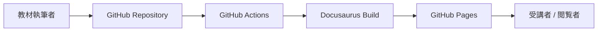

# 概要

このサイトは、IoTデバイス、SORACOM、AWSを利用したハンズオン教材をWebブラウザから参照できるようにするための教材基盤です。

## このサイトで扱うもの

- デバイスからSORACOMへデータを送信する基本手順
- SORACOM Air、Beam、Funnel、Harvest、Inventoryの確認ポイント
- AWS IoT Core、Lambda、S3、Timestreamへの連携手順
- よくあるエラーと切り分け方法
- ハンズオン終了後の後片付けと課金確認

## 対象者

- IoT通信とクラウド連携を短時間で体験したい方
- SORACOMとAWSを使ったワークショップを運営する方
- 教材をGitHubでレビュー、更新、再利用したい方

## サイト構成

## 進め方

1. [前提条件](./prerequisites.md)で必要なアカウントとツールを確認します。
2. デバイス、SORACOM、AWSの各章で個別設定を確認します。
3. [ハンズオン](./labs/01-device-to-soracom.md)を順番に実施します。
4. エラーが出た場合はトラブルシューティングを参照します。

:::warning
AWSアクセスキー、SORACOM APIキー、SIM ID、IMSI、秘密鍵などの実値は、教材本文、Issue、Pull Requestに記載しないでください。
:::
