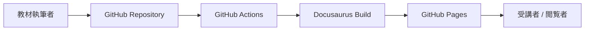

# はじめに

このサイトは、IoTデバイス、SORACOM、AWSを利用した小さなハンズオンを集めたドキュメントサイトです。

全体を一つのコースとして順番に進めるのではなく、目的に合うハンズオンを選んで単体で実施できる構成にします。

## このサイトで扱うもの

- デバイスからSORACOMへデータを送信する手順
- SORACOM Air、Beam、Funnel、Harvest、Inventoryの確認ポイント
- AWS IoT Core、Lambda、S3、Timestreamを使う個別手順
- よくあるエラーと切り分け方法
- ハンズオンごとの後片付けと課金確認

## 対象者

- IoT通信やクラウド連携を部分的に試したい方
- SORACOMやAWSを使う小さなワークショップを組み立てたい方
- ハンズオンをGitHubでレビュー、更新、再利用したい方

## サイト構成

## 使い方

1. [ハンズオン集](./labs/index.md)から目的に近いページを選びます。
2. 選んだページの冒頭で、そのハンズオンに必要なアカウント、機材、権限を確認します。
3. 必要に応じてデバイス、SORACOM、AWSの個別ページを参照します。
4. エラーが出た場合はトラブルシューティングを参照します。

:::info
[準備メモ](./prerequisites.md)は全ハンズオン共通の必須条件ではありません。各ハンズオンで必要なものを確認するためのチェック観点です。
:::

:::warning
AWSアクセスキー、SORACOM APIキー、SIM ID、IMSI、秘密鍵などの実値は、教材本文、Issue、Pull Requestに記載しないでください。
:::
