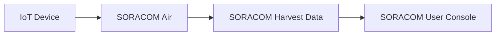

# デバイスからSORACOMへ送信

## このハンズオンで作るもの

IoTデバイスからSORACOMへデータを送信し、SORACOM Harvest Dataで受信結果を確認します。

## 対象者

SORACOM Airの基本通信とデータ送信を体験したい受講者。

## 所要時間

45分

## このハンズオンの前提

- SORACOM IoT SIMが登録済み
- デバイスからインターネット疎通できる

## 使用するもの

- IoTデバイス
- SORACOM IoT SIM
- SORACOM Harvest Data

## 構成例

## 手順

### 1. 事前準備

デバイス、SIM、SORACOMグループを確認します。

### 2. デバイス設定

通信モジュール、APN、ルーティング、時刻同期を確認します。

### 3. SORACOM設定

対象SIMのグループでHarvest Dataを有効化します。

### 4. AWS設定

このハンズオンではAWS設定は行いません。

### 5. 動作確認

デバイスからサンプルJSONを送信し、Harvest Dataに表示されることを確認します。

## よくあるエラー

- SIMがオンラインにならない
- Harvest Dataが有効化されていない
- JSON形式が正しくない

## 後片付け

必要に応じてHarvest Dataを無効化し、不要なデータを削除します。

## 関連ページ

- [SORACOM Harvest](../soracom/harvest.md)
- [SORACOM Air](../soracom/air.md)
- AWS連携まで試す場合は[SORACOMからAWSへ連携](./02-soracom-to-aws.md)を参照します。
