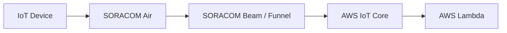

# SORACOMからAWSへ連携

## このハンズオンで作るもの

SORACOMで受け取ったデバイスデータをAWS IoT CoreまたはLambdaへ連携する構成を作ります。

## 対象者

SORACOMとAWSの連携を体験したい受講者。

## 所要時間

60分

## 前提条件

- [デバイスからSORACOMへ送信](./01-device-to-soracom.md)を完了済み
- AWSアカウントにログインできる
- 必要なIAM権限が付与されている

## 使用するもの

- SORACOM BeamまたはFunnel
- AWS IoT Core
- AWS Lambda

## 全体構成

## 手順

### 1. 事前準備

AWSのリージョン、IAM権限、受信トピックを確認します。

### 2. デバイス設定

デバイスの送信先をSORACOM向けに設定します。

### 3. SORACOM設定

BeamまたはFunnelの設定をSIMグループに追加します。

### 4. AWS設定

AWS IoT CoreのルールとLambda関数を作成します。

### 5. 動作確認

デバイスから送信したデータがCloudWatch Logsに出力されることを確認します。

## よくあるエラー

- AWS側のIAM権限が不足している
- SORACOM認証情報ストアの値が間違っている
- AWS IoT Coreのトピック名が一致していない

## 後片付け

Lambda関数、IoTルール、認証情報、SORACOMグループ設定を削除または無効化します。

## 次に進む

[データの可視化](./03-visualize-data.md)へ進みます。
