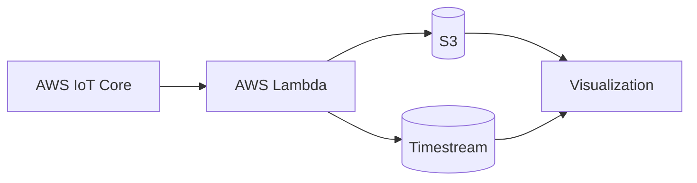

# データの可視化

## このハンズオンで作るもの

AWSに保存したIoTデータをクエリし、簡易的に可視化する流れを確認します。

## 対象者

データ保存後の確認、可視化、後片付けまで体験したい受講者。

## 所要時間

45分

## このハンズオンの前提

- S3またはTimestreamにIoTデータ、または検証用サンプルデータが保存されている
- データ保存先を確認できるAWS権限がある

## 使用するもの

- Amazon S3またはAmazon Timestream
- AWSコンソール
- 必要に応じて可視化ツール

## 構成例

## 手順

### 1. 事前準備

保存先、データ形式、確認方法を決めます。

### 2. データ送信元の確認

利用するデータが実デバイス由来か、サンプル投入データかを確認します。

### 3. SORACOM設定

BeamまたはFunnelの設定が有効であることを確認します。

### 4. AWS設定

保存先のS3バケットまたはTimestreamテーブルを確認します。

### 5. 動作確認

最新データをクエリし、値が更新されることを確認します。

## よくあるエラー

- データ型が可視化ツールの想定と違う
- Timestreamの保持期間を過ぎている
- S3のオブジェクトキーが想定と違う

## 後片付け

作成したAWSリソースを削除し、SORACOM側の課金対象設定を見直します。

## 関連ページ

- AWSへデータを保存する構成から作る場合は[SORACOMからAWSへ連携](./02-soracom-to-aws.md)を参照します。
- 関連用語は[用語集](../appendix/glossary.md)で確認できます。
